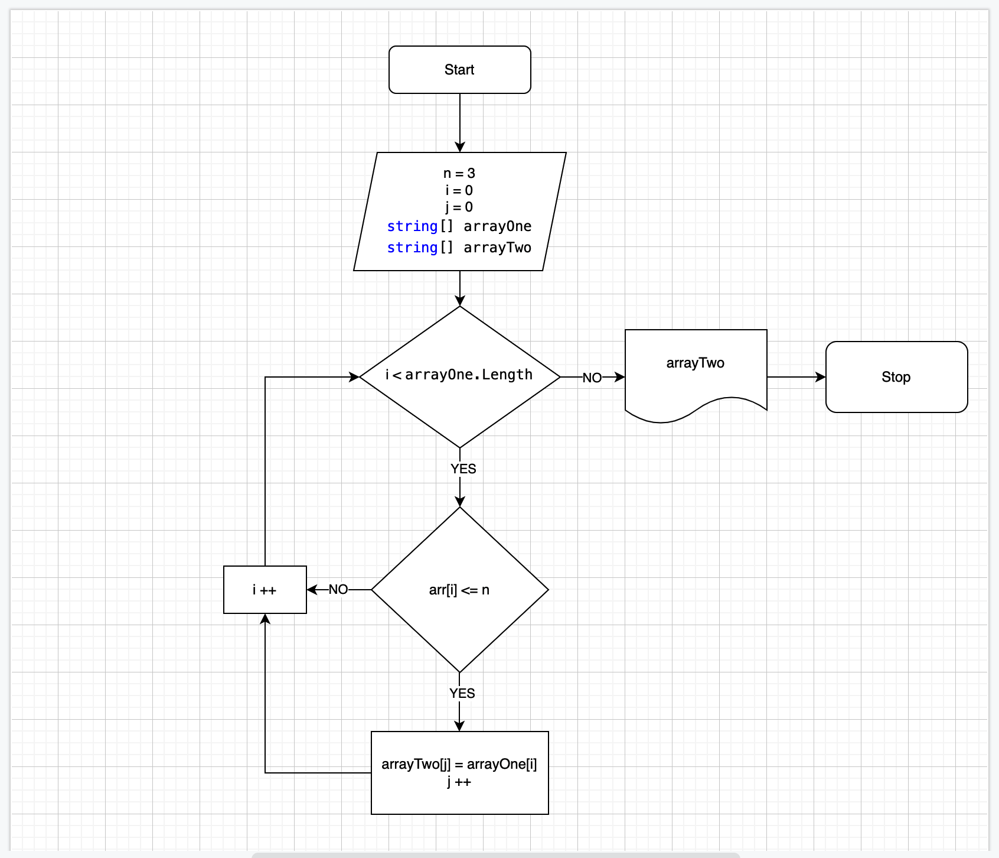

 # Итоговая работа

                    Лялин А.А.

 ## Задача:

 * Написать программу, которая из имеющегося массивастрок формирует новый массив из строк, длинна которых меньше, либо равна 3 символам. Первоначальный массив можно ввести с клавиатуры, либо задать на старте выполнения алгоритма. 
 
 *При решении не рекомендуется пользоваться коллекциями, лучше обойтись исключительно массивами.*

### Алгоритм решения:

 1. Создал строковый массив
 2. Создал метод, заполняющий массив (*FillArray*) значениями которые вводит пользователь.
 3. Создал метод, заполняющий массив рандомными значениями (*закомичен в коде*)
 4. Создал метод вывода заполненного массива поэлементно на экран (*PrintArray*).
 5. Создал метод, определяющий длинну нового массива (*GetSizeSecondArray*).
 6. Создал условие окончания решения, если размер второго массива равен нулю.
 7. Создал метод, переносящий определенные по условию задания элементы из начального массива в новый (*TransferElements*).
 8. Вывод на экран нового массива.

## Дополнительная информация

    Блок-схема решения задачи
 

